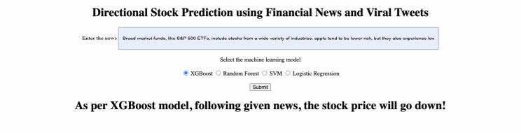
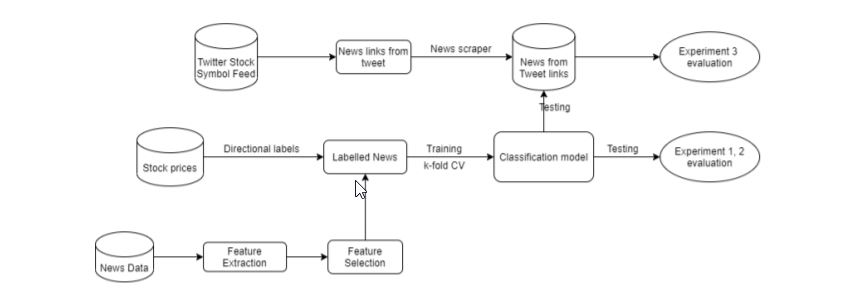

## Bidirectional stock prediction using News and Twitter analysis

##### In this project, I trained a bidirectional stock price prediction system based on financial corpus consisting of about 90,000 news articles for Apple and Amazon stocks. I ran multiple different experiments with two separate time periods (1 day and 4 hours) to see which combinations of time period, feature extraction and selection techniques has the highest prediction accuracy. 
##### After that, I compared the various models based on parameters like accuracy and F1 score to find out the best model that predicts the correct directional stock value. I scraped news articles from viral tweets and used them as input to validate the model.

### Results:
The trained system predicted stock movements with accuracy up to 74 percent. I found that Random Forest classifier when used along with 1-gram feature extraction technique on a time period of 1 day has given the best overall accuracy. 

Then, I proceeded to extract the top 10 reliable news sources from the given data set and found that morningstar.com data set resulted in the best accuracy when tested on the 1-gram SVM model.

### Steps performed:
- **Data Pre-processing** - Preprocessing involved parsing news JSON data, tokenising, stemming, stop word removal, and labelling of the news articles. 
- **Feature Extraction** - Features were extracted from the labelled news data set. BERT pre-trained with FinBERT, Word2Vec, and n-gram models (1-gram and 2-gram) were used for feature extraction.
- **Feature Selection** - The important features were selected or totally new features may be generated using existing features. Chi2 and PCA are used for feature selection.
- **Model Training** - Train machine learning models using the classifiers - SVM using ThunderSVM library, Decision Tree, Logistic Regression, Random Forest using XGBoost and ANN (Artificial Neural Network).
- **Prediction** - Output +1 or -1 as direction of stock price based on whether the price may increase or decrease respectively.

#### System architecture:

### Replication steps:
Download the Processed CSV and pickle files from: 
https://drive.google.com/drive/folders/1dx7Nq3HDSbSzbnm9BfuLqyUaIOHigdJ1?usp=sharing

To run the testing UI and get the results please follow the following steps: (Tested on Mac PC) 
0. To use the trained models directly, please ensure that you have downloaded the trained models' pickle files as mentioned in './Code/input-testing/' folder readme.
1. Open the terminal and run the command sudo apachectl start.
2. Now run the command sudo nano /etc/apache2/httpd.conf.
3. Delete the # from #LoadModule php7_module libexec/apache2/libphp7.so
4. Now restart the apachet server with the command sudo apachectl restart.
5. Create a folder named Sites in your home directory and copy the working SWM project folder to the Sites folder.
6. Now in terminal run the command sudo nano /etc/apache2/httpd.conf and replace /Library/WebServer/Documents with the path of your Sites folder
7. Restart the apache server again as mentioned on step 4 and you can open the main.html page in Google chrome serving at the localhost 8080.

